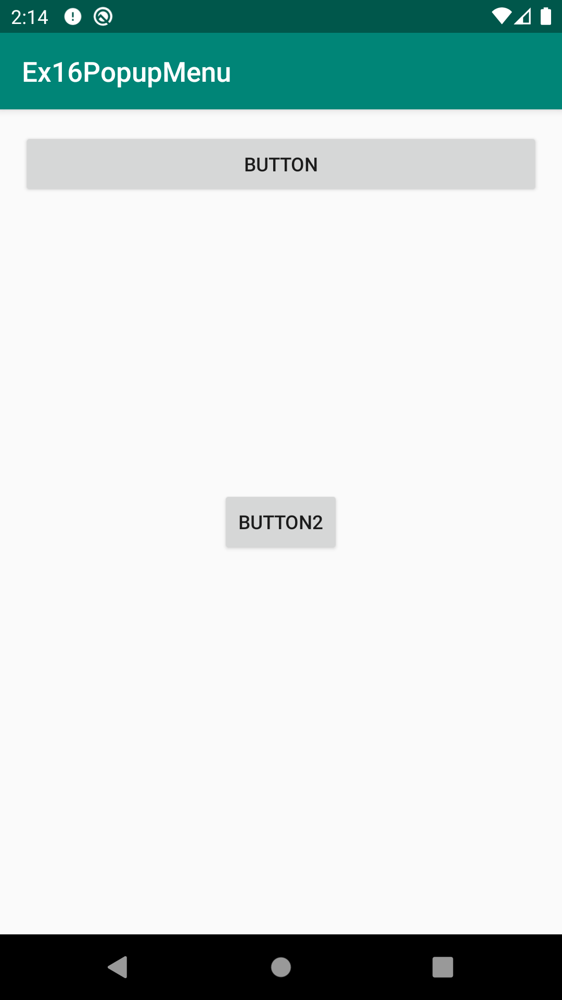
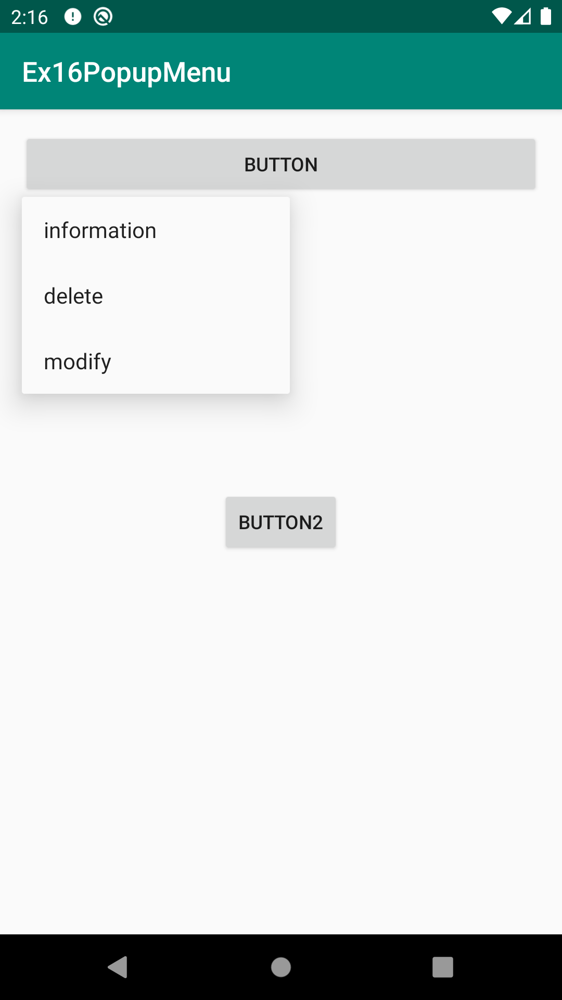
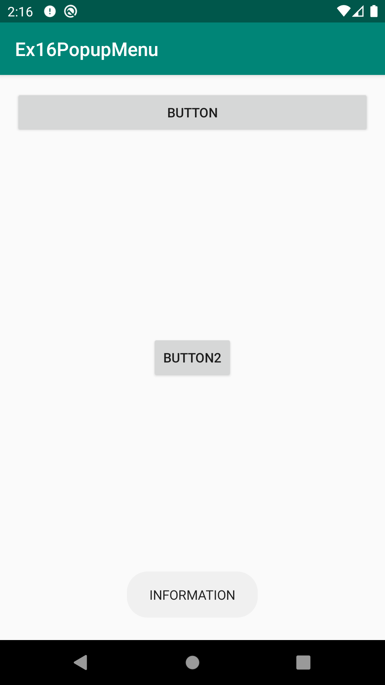
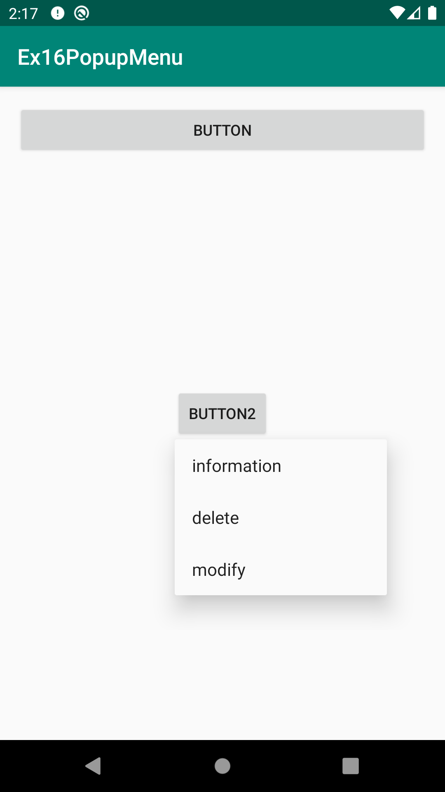
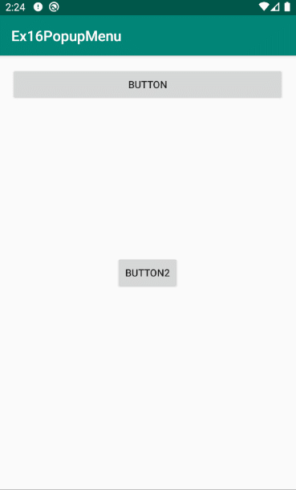

# Ex16PopupMenu
안드로이드 네이티브 앱 개발 수업 예제#16

# 주요코드
PopupMenu 추가하기 [이전 컨텍스트메뉴와 다르게 원하는 위치에서 메뉴가 보이게 하고 싶을때 사용하는 메뉴]

- 컨텍스트메뉴처럼 버튼을 롱~클릭했을때 버튼에 메뉴 보이기
- OptionMenu나 Context메뉴처럼 액티비티에 create하는 메소드가 존재하지 않음.
- 메뉴객체가 놓여지길 원하는 위치에 PopupMenu객체 생성하여 붙이고(anchor view 설정) 그 PopupMenu객체안에 있는 Menu객체에 MenuItem을 추가하여 보이도록 함.
- 다른 메뉴들과 마찬가지로 XML언어로 메뉴항목들을 설계하고 자바언어의 MenuItem객체로 만들어서(부풀리다inflate) Menu에 추가하는 방법을 사용함.
    > res폴더>>menu폴더 생성 [ res폴더에서 마우스오른쪽버튼 메뉴에서 'Android Resource Directory' 선택 후 위에서 2번째 항목의 'Resource Type'에서 'menu'선택하면 menu폴더 추가됨]
    > menu폴더에 있는 context.xml문서를 읽어와서 Menu객체로 만들어주는(부풀려주는inflate) 객체인 MenuInflater사용
- PopupMenu의 Menu(MenuItem)클릭 반응하기
- 버튼을 롱~클릭했을때 다른 버튼에 팝업메뉴가 붙어서 보이도록 지정하기

# 실행모습

  
  
  
  

# 실행모습 GIF

  

